# music-shop-front-rebuild(音乐商城)(更新中)

~~ 项目地址:暂时没有 ~~

~~ 后端地址:暂时没有 ~~

## 技术栈
1. vuex
2. vue-router
3. font-awesome
4. element-ui
5. swiper5
6. axios
7. qs
8. ~~ lodash ~~
9. ~~ node-sass ~~

## 使用说明

### Project setup
```
npm install
```
### 手动安装
```
npm i vuex -S
npm i vue-router -S
npm i fontawesome -S
npm i element-ui -S
npm install swiper@5
npm i axios -S
npm i lodash-S
npm i qs -S
npm i node-sass
```

### 用户名密码
普通用户<br>用户名：lisi
密码：123456<br>管理员用户<br>
用户名：admin
密码：123456

## 普通用户实现功能截图及测试
### 模块封装:

axios（封装了请求/响应拦截器、发送模块）

<br>

### 商城主页：

<strong>完成情况：</strong>

<strong>接口：</strong>

(未实现)UserLoginController/login

<br>

<strong>界面：</strong>

轮播图（鼠标悬停停止轮播）

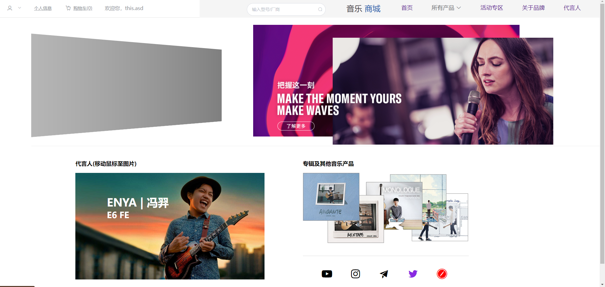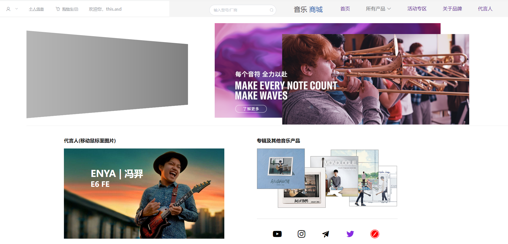


<hr>


### <strong>购物车页面：</strong>

### 实现功能：总价计算，发送删除/购买对象

<strong>完成情况：</strong>

接口：

get：shoppingCartController/没想好(不一定写)

post：ushoppingCartController/没想好

<br>

<strong>界面： </strong>

<strong>总价计算：</strong>

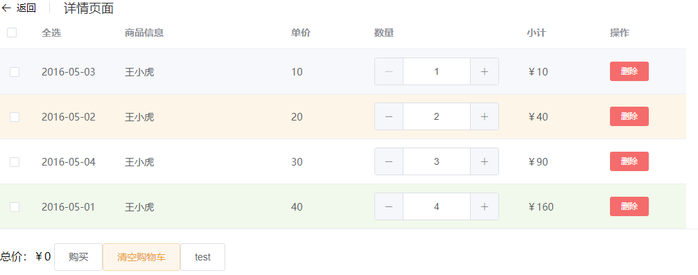

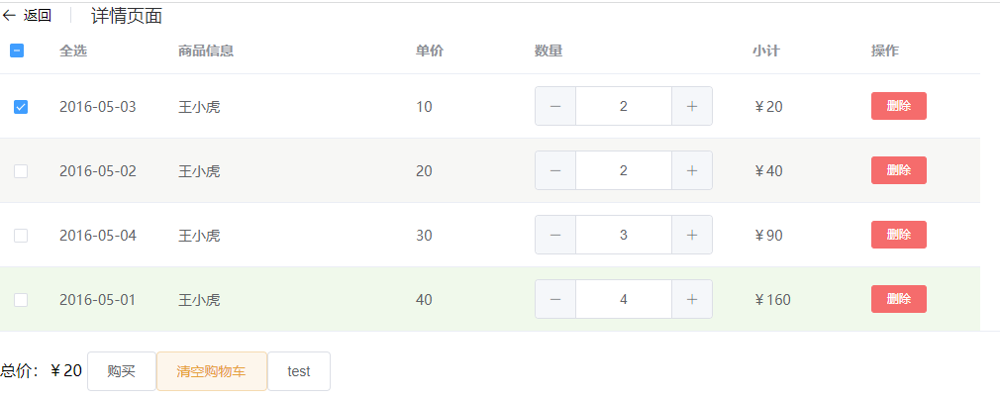

### 购买以及删除等功能：

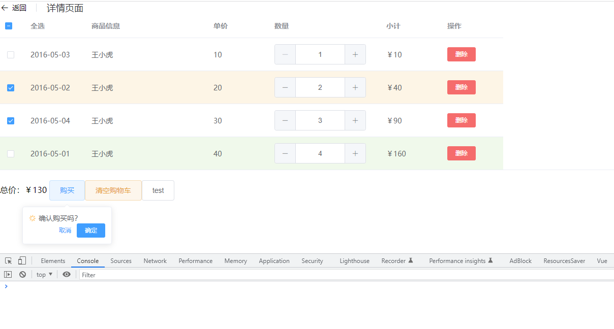

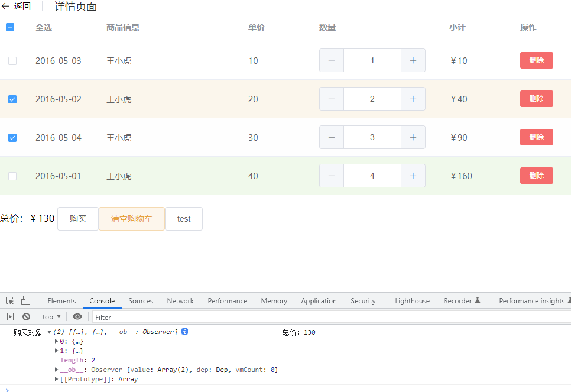
<strong>清空购物车/删除单个商品功能：</strong>

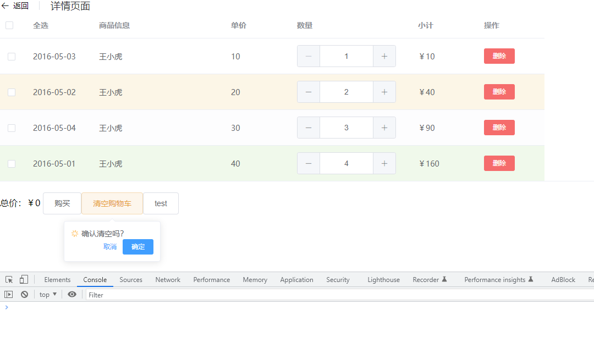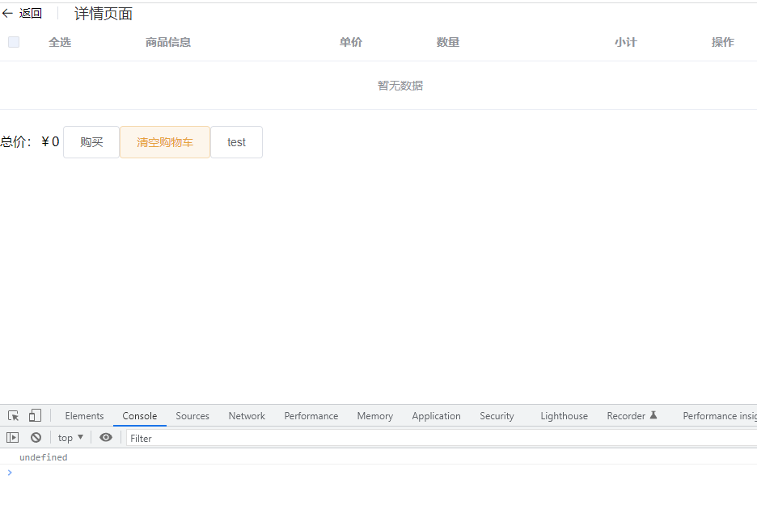


<hr>


### 个人主页：

<strong>完成情况：</strong>

接口：

get：userinfomationController/没想好(不一定写)

post：userinfomationController/没想好

<br>

<strong>界面： </strong>

如图所示，后期实现数据动态绑定
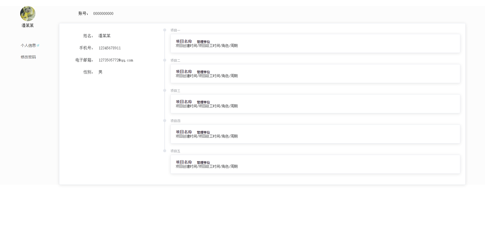

### 发送验证码等待
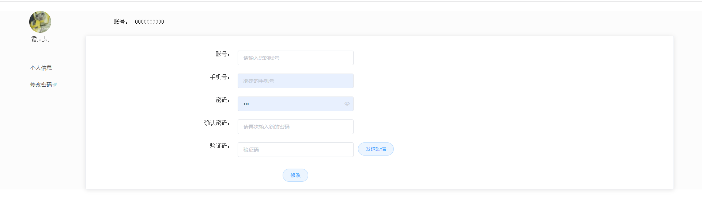
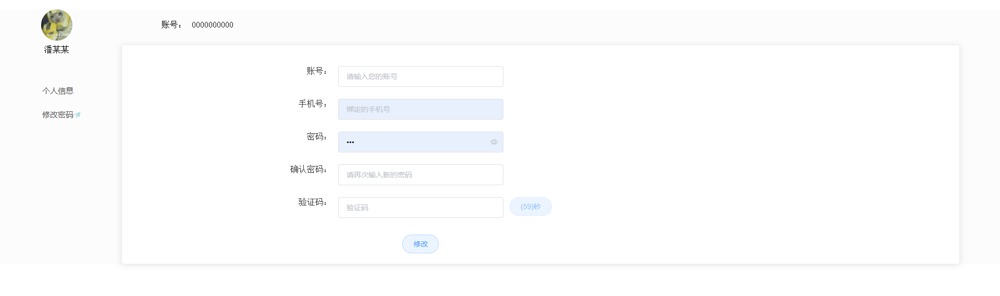


<hr>


### 登录界面

<strong>完成情况：</strong>

界面：没写

<br>

接口：

get：TestController/user

post：TestController/user2

接口测试结果：

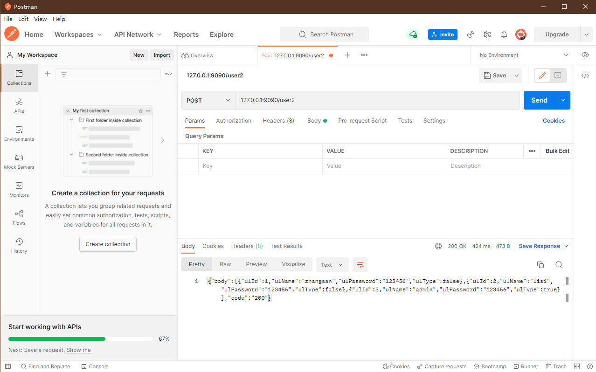


<hr>


### 所有商品界面

<strong>完成情况：</strong>

界面：没写

<br>

<strong>接口（均未实现）:</strong>

get：productInfomationController/没想好(不一定写)

post

查询所有商品：productInfomationController/queryAllProduct（pagehelper插件实现分页）

查询单个商品：

通过型号查询（模糊查询）

productInfomationController/queryAllProductByName

通过厂商查询（模糊查询）

productInfomationController/queryAllProductByManufacturer

通过类型查询（=）(router-link传递参数)

productInfomationController/queryAllProductByType


<hr>


### 购买商品界面

<strong>完成情况：</strong>

界面：没写

（主要实现canvas实现zoom效果（电商放大镜））

<br>

<strong>接口（均未实现）:</strong>

通过id查询(用户无法使用)()

productInfomationController/queryAllProductById


<hr>


### 后台管理员用户界面实现功能及截图<br>

<strong>完成情况：</strong>

界面：没写

<br>

接口：没写

<br>

预计实现效果如图

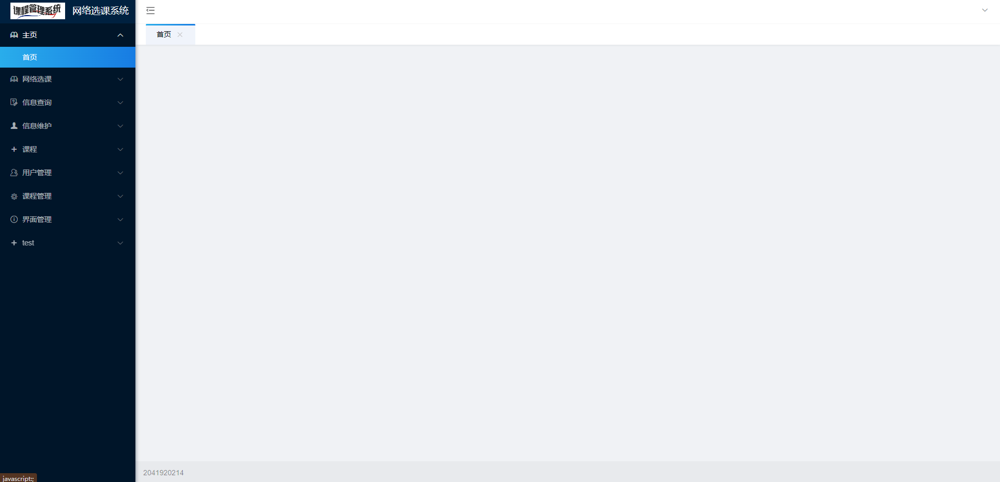


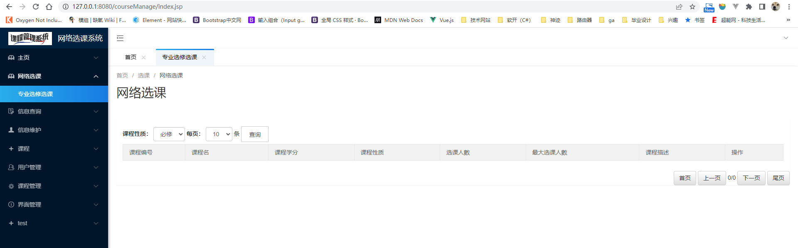
